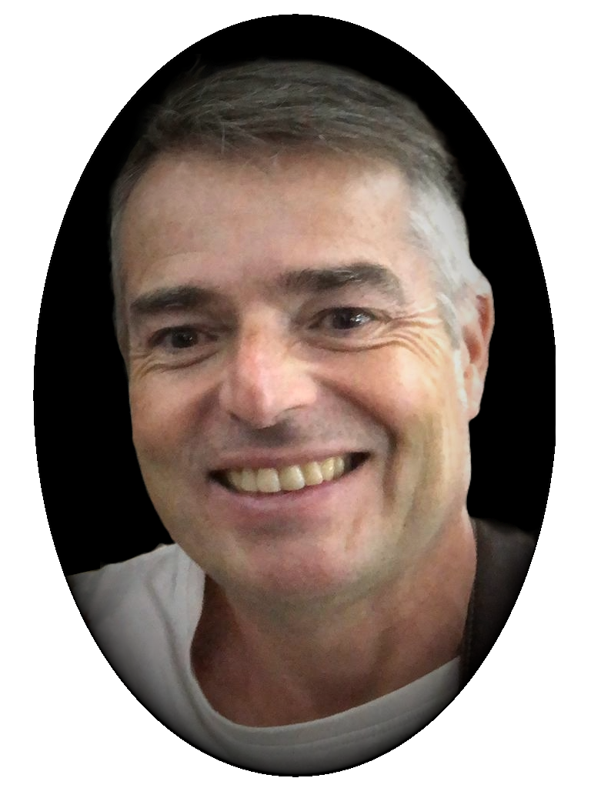

# Laurent LAPORTE

## Bienvenue

Mon Curriculum vitæ est disponible en 🇫🇷 [Français](fr/index.md), ma langue maternelle.

Fort de plusieurs années d’expérience en tant que leader technique, j’ai dirigé des équipes de développement, recruté et
formé de nouveaux développeurs.

Spécialisé en développement backend (Python, Django, FastAPI, Pandas), je suis également compétent en développement
frontend (React, Angular) et l’administration système (Windows, Linux, macOS, Docker).
Habitué aux méthodes agiles (Scrum, Jira) et aux outils de CI/CD (GitHub Actions, Jenkins), je possède une connaissance
approfondie des architectures logicielles, bases de données (MySQL, PostgreSQL), services web (REST), des tests
unitaires et fonctionnels (Pytest, Selenium), qualité logicielle (SonarCloud, Codecov, Ruff, Mypy) et documentation
technique (Sphinx, MkDocs, Confluence).

Autonome et capable de communiquer efficacement avec les clients et les équipes, je suis mobile sur Laval, Rennes et
Paris, et ouvert au télétravail.
J’ai récemment terminé une formation en management, renforçant ainsi mes compétences en gestion d’équipe.

Je suis disponible pour un entretien à votre convenance et vous remercie pour l’attention portée à ma candidature.

## Welcome

My Curriculum vitae is available in 🇬🇧 [English](en/index.md), my second language (B2 level).

With several years of experience as a technical leader, I have managed development teams, recruited and trained
new developers.

Specialized in backend development (Python, Django, FastAPI, Pandas), I am also proficient in frontend development
(React, Angular) and system administration (Windows, Linux, macOS, Docker).
Accustomed to agile methods (Scrum, Jira) and CI/CD tools (GitHub Actions, Jenkins), I have in-depth knowledge
of software architecture, databases (MySQL, PostgreSQL), web services (REST), unit and functional testing (Pytest,
Selenium), software quality (SonarCloud, Codecov, Ruff, Mypy) and technical documentation (Sphinx, MkDocs, Confluence).

Autonomous and able to communicate effectively with clients and teams, I am mobile in Laval, Rennes and Paris, and open
to telecommuting. Paris, and open to telecommuting.
I recently completed a management course, enhancing my team management skills.

I am available for an interview at your convenience and would like to thank you for considering my application.

## Willkommen

Mein Lebenslauf ist verfügbar in 🇩🇪 [Deutsch](de/index.md), meine dritte Sprache (B1 Niveau).

Mit meiner mehrjährigen Erfahrung als technischer Leiter habe ich Entwicklungsteams geleitet, neue Entwickler
eingestellt und geschult.

Spezialisiert auf Backend-Entwicklung (Python, Django, FastAPI, Pandas), bin ich auch versiert in Frontend-Entwicklung
(React, Angular) und Systemadministration (Windows, Linux, macOS, Docker).
Gewöhnt an agile Methoden (Scrum, Jira) und CI/CD-Tools (GitHub Actions, Jenkins), habe ich fundierte Kenntnisse
in Softwarearchitektur, Datenbanken (MySQL, PostgreSQL), Webservices (REST), Unit- und Funktionstests (Pytest,
Selenium), Softwarequalität (SonarCloud, Codecov, Ruff, Mypy) und technische Dokumentation (Sphinx, MkDocs, Confluence).

Ich bin selbständig und in der Lage, effizient mit Kunden und Teams zu kommunizieren. Ich bin mobil in Laval, Rennes
und Paris und offen für Telearbeit.
Ich habe kürzlich einen Managementkurs abgeschlossen, um meine Team-Management-Fähigkeiten zu verbessern.

Ich stehe Ihnen jederzeit für ein Vorstellungsgespräch zur Verfügung und danke Ihnen für die Berücksichtigung
meiner Bewerbung.
